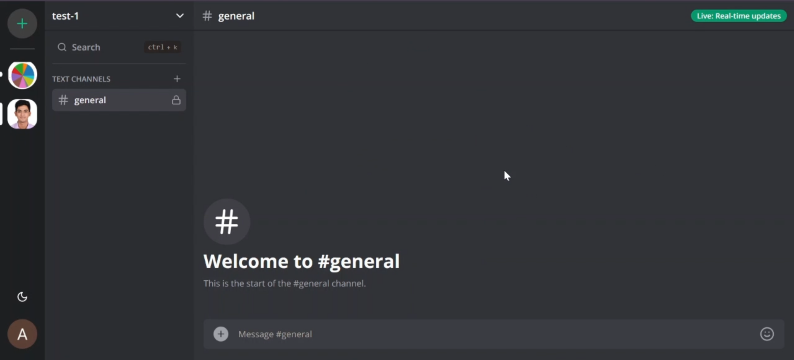
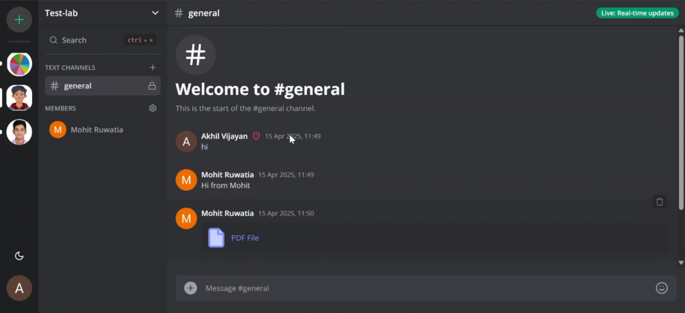
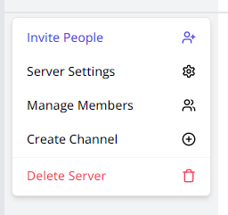
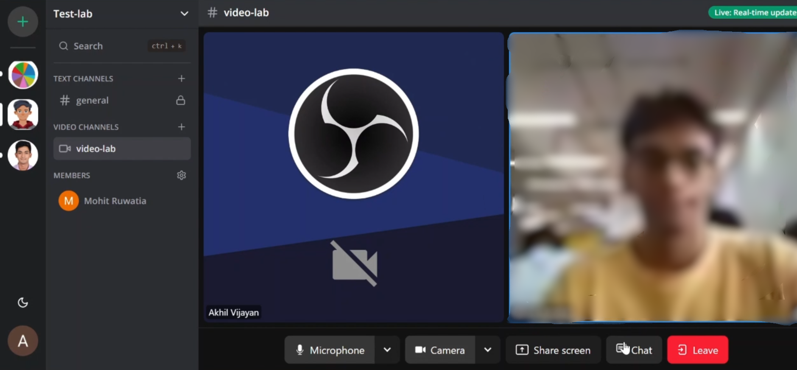
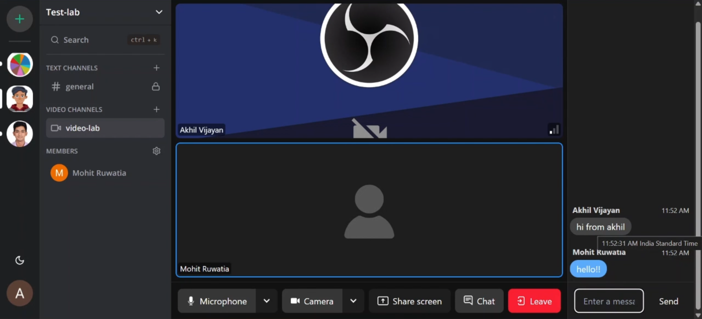
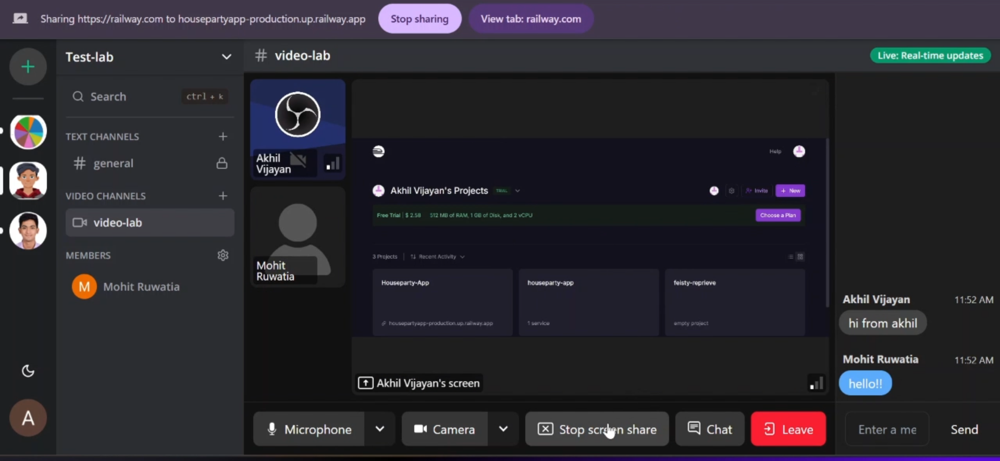

# Virtual Houseparty Application

## 🎥 Video Walkthrough

[Watch the full walkthrough here](https://drive.google.com/file/d/1n7ujXDS_zJzU10oQqDkIl1fhD35wosjB/view?usp=sharing)

---

## Overview

A modern, full-featured real-time chat and video houseparty app built with Next.js 13, React, TailwindCSS, Socket.io, Prisma, MongoDB, and more.

---

## 🚀 Key Features

- **Real-time Messaging:** Instant messaging with Socket.io for seamless communication.
- **Attachments:** Send images and PDFs as messages using UploadThing.
- **Edit & Delete Messages:** Modify or remove messages in real time for all users.
- **Channel Types:** Create text, audio, and video call channels.
- **1:1 Conversations:** Private direct messaging between members.
- **1:1 Video Calls:** Start video calls directly with other members.
- **Member Management:** Kick members, change roles (Guest / Moderator), and manage server membership.
- **Invite System:** Generate unique invite links and manage server invitations.
- **Infinite Message Loading:** Messages load in batches of 10 using TanStack Query for smooth infinite scroll.
- **Server Creation & Customization:** Create and personalize your own servers.
- **Modern UI:** Built with TailwindCSS and ShadcnUI for a beautiful, responsive interface.
- **Light / Dark Mode:** Toggle between light and dark themes.
- **Websocket Fallback:** Automatic polling with alerts if websockets are unavailable.
- **ORM & Database:** Uses Prisma ORM and MongoDB for robust data management.
- **Authentication:** Secure sign-in and sign-up with Clerk.
- **Video & Audio Rooms:** Powered by LiveKit for high-quality group calls.
- **File Uploads:** Secure and fast file uploads with UploadThing.
- **Mobile Friendly:** Fully responsive design for all devices.

---

## Tech Stack

- **React**
- **Next.js 13**
- **Tailwindcss**
- **Socket.io**
- **Prisma**
- **MongoDB**
- **Shadcn/ui**
- **LiveKit**
- **Uploadthing**
- **Clerk**

---

## References

1. [Socket.io docs](https://socket.io/docs/v4)
2. [Uploadthing docs](https://docs.uploadthing.com/)
3. [Livekit.io docs](https://docs.livekit.io/home/)
4. [Next.js docs](https://nextjs.org/docs)
5. [Chat Application Architecture Blog by Maria Romaniuk](https://medium.com/@m.romaniiuk/system-design-chat-application-1d6fbf21b372)
6. [Websockets video (Chess.com clone by Harkirat Singh)](https://www.youtube.com/watch?v=vSJsz7tNuyU)

---

## Screenshots
# Landing Page

# Conversation

# Features of server

# Video Chat

# Screen Share 

